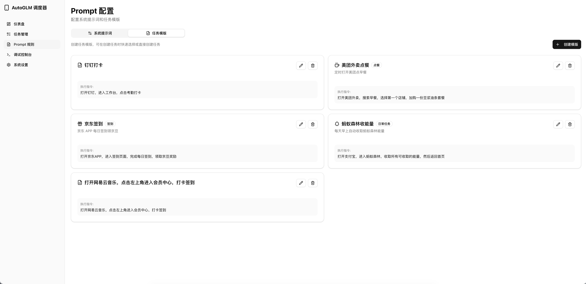
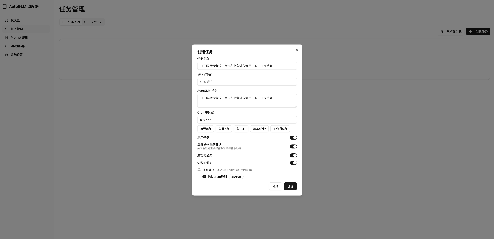
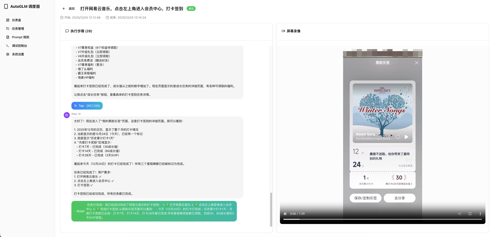

# Auto Phone Scheduler

[Readme in English](README_en.md)

<div align="center">

</div>

基于 Open-AutoGLM 的手机自动化定时任务系统，让 AI 帮你定时完成手机上的重复性工作。

## 特性

- **多设备管理** - 支持多台 Android 设备同时管理，可设置全局默认设备，任务可单独指定设备执行
- **WiFi 无线连接** - 支持通过 WiFi 连接 Android 设备，摆脱 USB 线缆束缚
- **自动亮屏解锁** - 任务执行前自动唤醒屏幕并解锁设备，实现真正的无人值守
- **实时调试控制台** - 实时画面投屏，支持鼠标滑动操作及 Home、Back、App 切换等快捷控制
- **智能提示词配置** - 针对不同设备配置专属系统提示词，优化 AI 执行效率
- **任务模版与定时执行** - 预设常用任务模版，支持 Cron 表达式灵活调度
- **完整执行记录** - 保存对话过程与屏幕录像，支持进度条拖动定位与录屏下载
- **多渠道通知** - 支持钉钉、Telegram 等方式实时推送任务结果
- **高级模型支持** - 兼容 Gemini 3 Pro 等多种模型
- **优化体验** - MonkeyPatch 实现流式响应，拓展 Launch 包名打开应用更高效

### 应用场景

各种APP会员每日签到、定时打卡、自动化浏览做任务、定时清理单向好友等，发挥你的想象力。

> ⚠️
> 本项目仅供研究和学习使用。严禁用于非法获取信息、干扰系统或任何违法活动，违反者责任自负。


## 功能预览

### 任务模版


### 任务创建


### 录像回放


### 调试控制台


更多功能等你来探索！

## 快速开始

### Docker 部署（推荐）

```bash
# 克隆项目
git clone https://github.com/copialot/auto-phone-scheduler.git
cd auto-phone-scheduler

# 确保宿主机 ADB 可以连接设备
adb devices

# 启动服务
docker compose up -d

# 访问 http://localhost:3000
```

> **注意**: Docker 容器通过 `host.docker.internal:5037` 连接宿主机的 ADB server，请确保宿主机已正确配置 ADB 并连接设备。

### 本地开发

#### 环境要求

- Python 3.11+
- Node.js 18+
- ADB（Android Debug Bridge）
- 已连接的 Android 设备

#### 安装与运行

```bash
# 后端
cd backend
pip install -r requirements.txt
uvicorn app.main:socket_app --host 0.0.0.0 --port 8000

# 前端
cd frontend
pnpm install
pnpm dev
```

### 配置

1. 通过 ADB 连接手机设备（需在宿主机执行 `adb devices` 确认连接）
2. 访问设置页面配置 AutoGLM API 密钥
3. 创建任务或使用模版开始自动化

## 开源协议

[MIT License](LICENSE)

## 致谢

- [AutoGLM](https://github.com/zai-org/Open-AutoGLM)
