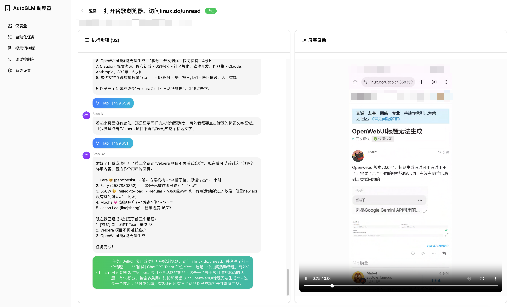

# Auto Phone Scheduler

[中文文档](README.md)

<div align="center">

</div>

An automated phone task scheduling system based on Open-AutoGLM, letting AI control your phone to complete repetitive tasks on schedule.

## Features

- **Smart Prompt Configuration** - Configure device-specific system prompts to optimize AI execution efficiency
- **Task Templates & Scheduled Execution** - Preset common task templates with flexible Cron expression scheduling
- **Complete Execution Records** - Save conversation history and screen recordings for review and debugging
- **Multi-Channel Notifications** - Real-time task result notifications via DingTalk, Telegram, and more
- **Advanced Model Support** - Compatible with Gemini 3 Pro and other models
- **Optimized Experience** - MonkeyPatch for streaming responses, enhanced app launching via package names

### Use Cases

Daily app check-ins, scheduled attendance, automated browsing tasks, scheduled cleanup of one-way friends, and more - use your imagination.

> ⚠️
> This project is for research and learning purposes only. It is strictly prohibited to use for illegal information gathering, system interference, or any illegal activities. Violators bear their own responsibility.

## Preview

### Task Templates


### Task Creation


### Recording Playback


### Web Crawler


More features waiting for you to explore!

## Quick Start

### Docker Deployment (Recommended)

```bash
# Clone the project
git clone https://github.com/copialot/auto-phone-scheduler.git
cd auto-phone-scheduler

# Ensure host ADB can connect to device
adb devices

# Start services
docker compose up -d

# Visit http://localhost:3000
```

> **Note**: Docker container connects to host ADB server via `host.docker.internal:5037`. Please ensure ADB is properly configured on the host and device is connected.

### Local Development

#### Requirements

- Python 3.11+
- Node.js 18+
- ADB (Android Debug Bridge)
- Connected Android device

#### Installation & Running

```bash
# Backend
cd backend
pip install -r requirements.txt
uvicorn app.main:socket_app --host 0.0.0.0 --port 8000

# Frontend
cd frontend
pnpm install
pnpm dev
```

### Configuration

1. Connect your phone via ADB (run `adb devices` on host to confirm connection)
2. Visit settings page to configure AutoGLM API key
3. Create tasks or use templates to start automation

## License

[MIT License](LICENSE)

## Acknowledgments

- [AutoGLM](https://github.com/zai-org/Open-AutoGLM)
